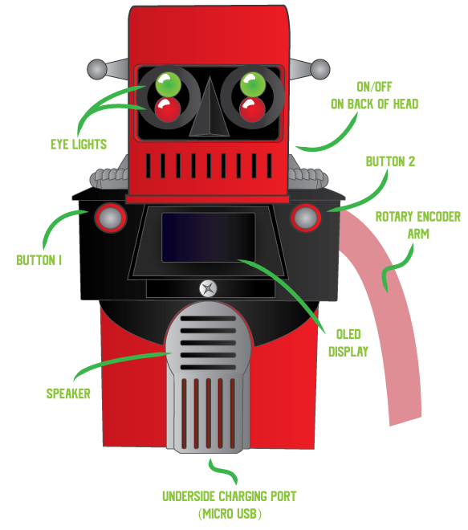

# G30-RG Documentation

# How to use:

### On/Off switch

On back of head. **One press for ‘on’, two rapid presses for ‘off’**. After turning **G30-RG** on, you will first see some green lights illuminate the inside of the robot’s body; then there is a bit of wait-time (around 1-2min) before **G30-RG** is ready for use.

### Charging

Charge the robot’s battery by plugging in a microUSB cord to the underside port (between the legs). When you plug power in, the robot will turn on as the battery charges.

When removing the power cord, the robot will switch off, but the battery will remain on. Always press the power button twice to switch off the battery after unplugging it from power.

### Inputs

Aside from on/off, **G30-RG** takes four different inputs:

- **Button 1** - to the left of the screen
- **Button 2** - to the right of the screen
- **Button 3 -** the right arm can be ‘pushed in’ towards the shoulder
- **Rotary -** The right arm can be rotated up and down

### Outputs

- OLED screen in centre of body displays text
- Speaker outputs faint audio
- Eyes light up ‘red’ or ‘green’

### Systems

By default, **G30-RG** will be on the ‘home screen’ (displaying the date, time, and a rotating cube ‘screen saver’). Rotate the right arm while on the home screen, and you will activate the ‘systems menu’. Continue to rotate the arm up or down to navigate the menu, then push **button 3** (push the arm in towards the shoulder) to select the highlighted system.

Below is a detailed list of all of **G30-RG**’s systems, and how to use them:

|  | Screen | Button 1 (left) | Button 2 (right) | Button 3 (arm) | Eyes (Red/Green) | Speaker |
| --- | --- | --- | --- | --- | --- | --- |
| Home Screen | Time/date, Rotating cube | Go to “Talk” |  | Main Menu | G | - |
| Talk | Text (conversation) | Respond “Yes” | Respond “No” | Main Menu |  | Speaks conversation. |
| Trivia | Text (questions & answers) | Display answer | New question | Main Menu | R: Question, G: Answer | Reads question/answer. |
| Weather | Text (weather info) | Exit to home | Exit to home | Main Menu | G | Speaks weather |
| AFL | Text (AFL info) | Discuss Essendon more | Change info that is displayed | Main Menu | R | Comments on Essendon’s AFL performance. |
| Jokes | Text (setups & punchlines) | Get punchline | New joke | Main Menu | R: Setup,
G: Punchline | Speaks jokes/punchlines. |
| 20 Questions | Text (Questions) | Respond “Yes” | Respond “No” | Main Menu | R: Thinking, G: Waiting |  |

---

# Known limitations:

### Poor Audio

The Pimoroni Audio Amp outputs line-level audio and is intended for 3W headphone drivers. The speaker in **G30-RG** is scavenged from a 1990s-era motherboard, and was only intended to make ‘beeps’ and ‘buzzer’ noises. As a result, the robot’s voice is so quiet it’s nearly indiscernible.

### Fragility

**G30-RG** is held together by tension, glue, and prayers. The internal wires are susceptible to shorts, and everything is *really* crammed inside the body. The robot would not survive a fall, or even a hard knock. Do not shake, squeeze, or sneeze on the robot.

### Start-up speed

**G30-RG** is running on a first-generation Raspberry Pi 0w (8 years old now). Work has been done to try and optimise the start-up time; but it’s an uphill battle against the capabilities of the hardware (1GHz single-core CPU, 512MB RAM).

The lack of external power indicator light is not ideal. This means there’s an awkward minute or so after pressing the ‘on’ button, where **G30-RG** appears to do nothing. You can make out some green light bleeding through a little hole on the rear of the robot’s body to confirm that the battery powered up, but still need to give it a decent wait before the robot’s main program loads and the OLED display turns on.

### Internet

All of the robot’s features (including its *clock*) require an internet connection to use. Connecting the robot to new Wi-Fi networks is not straightforward (it requires pre-planning and hard-coded adjustments). This ultimately means that **G30-RG** is limited to the homes that it was created for, and will not work outside of them (unless reprogrammed).

### Battery

The step-up converter that mediates between the battery and the Pi 0w boasts overheating and short-circuit protection; but makes no mention of *under voltage* protection*.* The documentation for this part is written in Chinese, so I can’t be certain either way. It’s important to note that Lipo batteries can suffer irreversible damage if under-charged, so *try not to run **G30-RG** to the point where it powers off due to dead battery.*

The expected battery life is ~1-2hours, though I haven’t tested this for the reasons described above.

### Misc design flaws

- The charging port is too fiddly, and would be better if moved to the lower-back, rather than underside.
- Having just one moveable arm is not ideal for posing.
- The on/off button was originally intended to be a ‘switch’, and does not fit properly into the chassis.
- The main red body part (the ‘abdomen’ of the robot) was printed with thin walls.
- The internal wiring is a horror show. I put together a ‘motherboard’ PCB; but it was too big to fit in the robot’s body. This isn’t a cosmetic issue, but would go along way in improving the robot’s overall robustness if addressed.

---

# Bill of materials:

- Raspberry Pi 0w
- 5v Step-up converter
- LiPo 1100mAh battery
- Micro-USB breakout
- Scavenged Speaker (8Ω 5W)
- Pimoroni Audio Amp SHIM
- ssd1306 OLED 0.96”
- Rotary encoder switch
- 2 x Green LED
- 2 x Red LED
- 3 x momentary switch
- 4 x 1kΩ resistors
- 3D printed body (PLA, 3 colours)

*Software BOM:*

- Raspberry Pi OS (Linux)
- Python 3.11
    - `openai` (ChatGPT)
    - `luma.core` (OLED Driver)
    - `espeak-ng-python` (TTS Generator)
- [OpenWeather](https://openweathermap.org/api) API
- [Squiggle](https://api.squiggle.com.au/) API (for AFL info)
- [Official Joke](https://official-joke-api.appspot.com/) API
- [Open Trivia DB](https://opentdb.com/api_config.php) API
- [OpenAI](https://platform.openai.com/) API

---